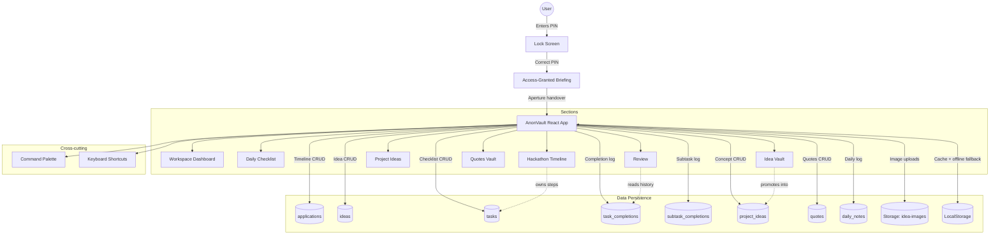

# High-Level Design (HLD): AnonVault

A high-level overview of AnonVault's architecture, data flows, and system components.

---

## System Architecture Overview

AnonVault is a client-first React + Vite application. It talks directly to a Supabase database with a localStorage cache underneath, and the whole workspace sits behind a 4-digit PIN lock screen.

There is no server of our own. Every read, write and decision happens in the browser, which shapes most of the design below — notably the local-first caches and the fact that the PIN is a UI gate rather than access control (see [Security posture](#security-posture)).



---

## Core System Components

| Component | Responsibility |
| :--- | :--- |
| **Lock Screen** | PIN keypad with failure feedback. On success, hands to the briefing overlay. |
| **Access-Granted Briefing** | A pre-flight glance rather than a splash: a progress dial of today's completion, count-up tiles for tasks due / hackathon deadlines this week / project ideas, and an adaptive summary. Skippable by any key or click; a tile click routes straight into that section. Reads only localStorage, because it runs *before* `isAuthorized` flips and therefore before any fetch has happened. |
| **Workspace Dashboard** | Aggregates a pulse strip (streak, 7-day rate, concepts building), the daily quote, the checklist snapshot, the closest hackathon with checklist progress, pinned concepts, and pinned drafts with stages. |
| **Checklist Manager** | Recurring and one-off tasks with subtasks, per-date completion, cancel-for-today, Mark All Done, optional hackathon ownership, and the daily log field. |
| **Timeline Tracker** | Hackathons split into upcoming (default) and past. Each entry can own a checklist via a six-step template, and gains a retrospective once resolved. |
| **Idea Vault** | Masonry concept cards. Promotion moves an idea into Project Ideas and archives the original. |
| **Project Pipeline** | Kanban board across `backlog / building / shipped / parked`, with drag between columns and a grid alternative. |
| **Review** | Aggregates the completion log across dates — rates, streaks, per-task reliability, hackathon funnel, and progress against user-set targets. |
| **Command Palette** | Cross-section search, navigation and quick capture in one surface. |
| **Sidebar Navigation** | Primary sections plus a secondary **More** group (Quotes). Badges show counts that need attention, not totals. |
| **Supabase Client** | CRUD payloads and connection handling. New optional columns are only included when set, so unmigrated databases keep working. |
| **Cloud Storage** | Uploaded images served via public URLs. |

---

## Core Data Flows

### 1. Unlock → briefing → handover

```
[Lock Screen]        [SessionStorage]      [LocalStorage]        [Dashboard]
      |                     |                    |                    |
      |-- 1. PIN entered -->|                    |                    |
      |   (matches VITE_APP_PIN)                 |                    |
      |-- 2. Read briefing counts -------------->|                    |
      |   (tasks today, deadlines, concepts — cache only, no network) |
      |-- 3. Dwell ~1.9s, dial + tiles + bar land together            |
      |   (any key or click skips; a tile click also picks the tab)    |
      |-- 4. Set authorized ->|                   |                    |
      |   ("minianon_authorized=true")            |                    |
      |== 5. Aperture collapses; staged reveal begins ===============>|
      |== 6. isAuthorized flips → loadData() fetches from Supabase ==>|
```

The ordering matters: the briefing renders **before** any network fetch exists, which is why it reads caches and why hackathon and concept counts come from caches written by the *previous* session.

### 2. Local-first synchronization

```
[Front-End]                      [Supabase]              [PostgreSQL]
     |                                |                        |
     |-- 1. Fetch all ---------------->|--- SELECT * ---------->|
     |   (on failure: use cache)       |<-- rows ---------------|
     |<-- 2. Render + write cache -----|                        |
     |                                 |                        |
     |== User mutates ==               |                        |
     |-- 3. Write cache (sync) ------->|  ← cache first, always |
     |-- 4. Write Supabase ----------->|--- INSERT/UPDATE ----->|
     |<-- 5. Confirm ------------------|<-- row ----------------|
     |-- 6. Bump tasksVersion          |                        |
     |   (every mounted view re-derives from the cache)         |
```

**Why cache-first:** every section stays mounted at once (tabs only toggle opacity), so a mutation in one view must be visible in the others without a refetch. A `tasksVersion` counter in `App.jsx` is bumped on every task mutation; each view re-derives from localStorage synchronously rather than issuing another three-query round trip.

### 3. The capture funnel

```
Idea Vault  --promote-->  Project Ideas  --stage-->  shipped
   |                          |                        |
   |                          |                        +--> Review: "shipped this month"
   +-- original archived, promoted_from FK retained
```

Promotion copies content, tags, links and images into a concept, records `promoted_from`, and **archives** the original rather than deleting it — the FK is `ON DELETE SET NULL`, so deleting would sever the trace it exists to record.

---

## Cross-Section Relationships

Sections used to be independent silos. Three links now connect them:

| Link | Mechanism |
| :--- | :--- |
| Hackathon → Checklist | `tasks.hackathon_id` — a Timeline entry owns tasks; progress surfaces on its card and on the dashboard. |
| Idea → Concept | `project_ideas.promoted_from` — traceable, and drives the "Promoted" badge. |
| Everything → Review | `task_completions` read across dates; `applications.status` for the funnel; `project_ideas.status` for ships. |

---

## Security posture

This section is deliberately blunt, because the app's framing invites the opposite assumption.

| Claim | Reality |
| :--- | :--- |
| The PIN protects the workspace | `VITE_APP_PIN` is inlined into the client bundle at build time and readable in the deployed JS. |
| Authorization is enforced | It is a `sessionStorage` flag (`minianon_authorized`), settable from devtools. |
| The database is protected | `schema.sql` **disables** RLS on all tables. With the anon key also in the bundle, anyone can read and write every row through the REST API without loading the app. |

What *is* true:

- **Session gating**: authorization lives in `sessionStorage`, so it clears on browser close.
- **Upload limits**: image uploads are capped at 1.5MB to protect the localStorage cache.
- **Graceful degradation**: a missing table or column fails soft to local-only behaviour rather than breaking the app.

To make it genuinely private: enable RLS on all tables, create a Supabase Auth user, scope every policy to `auth.uid()`, and have the PIN screen perform a real sign-in instead of setting a flag. A host-level password is the cheaper stopgap but leaves the database itself open.

---

## Known Limitations

- **Single JS chunk** (~730KB). All seven sections are bundled and mounted together; code-splitting per tab is the obvious fix and would also allow mounting only the active section.
- **Mobile is unverified.** Layouts carry responsive classes but have not been validated below ~400px.
- **No export or backup.** Undo-on-delete is the only safety net.
- **Archive and pin state are device-local**, stored in localStorage rather than synced.
